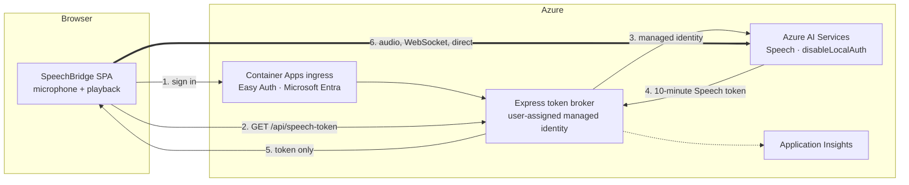

<!-- markdownlint-disable MD033 -->
# SpeechBridge — near-realtime interpreted conversation on Azure

[](https://codespaces.new/Azure-Samples/speechbridge)
[](https://vscode.dev/redirect?url=vscode://ms-vscode-remote.remote-containers/cloneInVolume?url=https://github.com/Azure-Samples/speechbridge)
[](LICENSE.md)

Two people who do not share a language sit at one laptop. Each speaks naturally; the other
hears it in their own language, in a natural voice, about half a second after they stop.
Live captions stream in both languages while you are still talking, and the interface shows
the **measured** latency of every turn rather than asking you to take "realtime" on faith.

**Deploys in one command.** `azd up` provisions everything, wires up managed identity,
turns on Microsoft Entra sign-in, and gives you a URL.

```
English -> Hindi    "Good morning."  ->  सुप्रभात।    0.2s · 0.2s · 0.4s
Hindi -> English    "नमस्ते."         ->  Hello.       0.2s · 0.2s · 0.5s
                                           caption · translation · heard
```

---

## Important Security Notice

**This accelerator contains no API keys, and cannot.** That is the central design decision,
not a detail.

The Azure AI Services account is provisioned with `disableLocalAuth: true`, so keys cannot be
issued even by an administrator. The web app authenticates using a **user-assigned managed
identity** holding the *Cognitive Services Speech User* role. There is no secret in the
repository, in app settings, in deployment outputs, or in your `.env`.

The browser never receives a durable credential either. It gets a **Speech-scoped token that
expires in ten minutes**, minted server-side — never a Microsoft Entra access token, which
would be accepted by every Cognitive Services resource the identity can reach.

The deployed site sits behind **Container Apps built-in authentication (Microsoft Entra)**, and
the application *additionally* refuses to mint a credential unless the platform supplies an
authenticated principal. If authentication is misconfigured, the app **fails closed** — it
stops working rather than publishing a credential-minting endpoint to the internet.

**Before you use this beyond a demo,** read [`SECURITY.md`](SECURITY.md) for what it
deliberately does *not* do — no rate limiting, no Content-Security-Policy, and public
network access on the AI account — and [`docs/RESPONSIBLE_AI.md`](docs/RESPONSIBLE_AI.md)
for where machine interpretation should never be used.

This accelerator is a starting point, not a certified production system. You are responsible
for reviewing it against your own security, privacy and compliance requirements.

---

## Features

- **Bidirectional interpretation.** Speak in your language, they hear theirs; they speak,
  you hear yours. 16 languages including English, Hindi, Kannada, Tamil, Telugu, Marathi,
  Spanish, French, German, Italian, Portuguese, Japanese, Korean, Chinese, Russian, Arabic.
- **Live captions in both languages**, streaming as you speak, with correct script direction
  so Arabic renders right-to-left.
- **Honest latency.** Every turn shows time-to-caption, time-to-translation and
  time-until-heard. Typically `0.2s · 0.2s · 0.5s`.
- **Keyless by construction.** Managed identity end to end; the browser holds only a
  ten-minute Speech-scoped token.
- **Cannot hear itself.** The microphone is muted at the device during playback, so the app
  never translates its own synthesized voice in a loop.
- **One-command deploy.** `azd up` provisions, configures identity and RBAC, creates the
  Entra app registration, and enables sign-in.
- **Verifiable.** 177 unit tests, an end-to-end check that drives real speech through a real
  browser in both directions, a live catalogue check against Azure, and design tokens that
  fail the build if they break WCAG contrast.

### Architecture



**The audio never touches our server.** Step 6 goes straight from the browser to Azure
Speech; putting our backend in that path would add a hop to every audio frame and defeat the
latency goal. The server exists only to mint credentials.

### Costs

Verified against the Azure Retail Prices API for `eastus2` on 2026-08-10. Prices vary by
region and change over time — confirm with the
[Azure pricing calculator](https://azure.microsoft.com/pricing/calculator/).

| Resource | Driver | Indicative cost |
|---|---|---|
| **Container Apps** (Consumption) | Per request; scales to zero | Free grant covers light demo use; set `MIN_REPLICAS=0` to idle at no cost |
| Container Registry (Basic) | Image storage | about $0.17/day |
| Azure AI Services **S0** | Per hour of audio processed | See [Speech pricing](https://azure.microsoft.com/pricing/details/cognitive-services/speech-services/) — billed only while speaking |
| Log Analytics | Data ingested | **$2.76/GB** (first 5 GB/month typically free) |
| Application Insights | Included in Log Analytics ingestion | — |

Container Apps bills per request and can scale to zero, so an idle demo is close to free.
The default keeps one warm replica to avoid a cold start on first use; set
`azd env set MIN_REPLICAS 0` to idle at no compute cost. **Run `azd down` when you are
finished** so the registry and workspace stop accruing too.

> **Deployed and verified on 2026-08-10.** `azd up` provisioned the resource group, AI
> Services account, managed identity, registry, Container Apps environment and app, built the
> image remotely, created the Microsoft Entra app registration, and enabled sign-in.
> An unauthenticated request to the deployed site returns `302` to the Microsoft sign-in page.

> **S0 is required, not preferred.** The free tier permits one concurrent recognition and
> caps text-to-speech at 20 transactions per 60 seconds; a floor change briefly overlaps two
> recognizers.

---

## Getting Started

### Deploy to Azure (one command)

You need an Azure subscription, the [Azure Developer CLI](https://aka.ms/azd), and the
[Azure CLI](https://learn.microsoft.com/cli/azure/install-azure-cli). Or click the
Codespaces badge above and get all of it preinstalled.

```bash
azd auth login
azd up
```

`azd up` asks for an environment name and region, then provisions the AI Services account
with a custom subdomain, a managed identity with the Speech User role, the container registry, Container Apps environment and app, and Log Analytics — then deploys the app, creates the Microsoft Entra app
registration and switches on sign-in. It prints your URL when it finishes.

**Regions:** choose one that supports Azure AI Speech. The template restricts the parameter
to a validated list; `eastus2`, `westus3`, `swedencentral` and `centralindia` are all good
choices.

**If your account cannot create app registrations** — common in locked-down tenants — the
deployment still succeeds and tells you exactly what to do:

```bash
# after an administrator creates an app registration with the printed redirect URI
azd env set AUTH_CLIENT_ID <application-client-id>
azd provision
```

Until then the site is deployed but refuses to work, by design.

To remove everything:

```bash
azd down --purge
```

### Run it locally

```bash
npm install
cp .env.example .env      # no API key required
az login
npm run dev
```

Open <http://localhost:5173>. Hold the floor with **`1`** or **`2`**, talk, press **`Esc`**
to release.

Locally the server binds to **loopback only** and validates the `Host` header, because the
credential endpoint has no user authentication there. That is deliberate — see
[ADR-0003](docs/adr/0003-short-lived-sts-token-broker.md).

> **Use a headset if you can.** The microphone is muted during playback so the app cannot
> hear itself, but a headset is cleaner in a live room.
>
> **Pause between sentences.** End-of-utterance is detected after 350 ms of silence, so a
> pause commits the phrase and starts translating. That is the deliberate trade for speed.

### Verify it

```bash
npm test                  # unit tests
npm run verify:e2e        # real speech through a real browser, both directions
npm run verify:voices     # catalogue still matches the live service
npm run bench:synthesis   # re-measure the synthesis latency question
node .ironclad/gate.mjs --stage packet     # the definition of done
```

---

## Guidance

### How it works

| Path | Responsibility |
|---|---|
| `infra/` | Bicep: AI Services, managed identity, RBAC, Container Apps, registry, monitoring |
| `src/shared/languages.ts` | The 16 languages, recognition locales and verified voices |
| `src/server/tokenBroker.ts` | Entra → Speech STS exchange, cached, refreshed at 80% of life |
| `src/server/localGuard.ts` | Who may mint a credential: loopback locally, Entra principal when deployed |
| `src/client/conversation.ts` | Who holds the floor, what is believed, what is transcribed |
| `src/client/micGate.ts` | Mutes the microphone during playback so the app cannot hear itself |
| `src/client/azureSpeech.ts` | The only file that knows the Speech SDK exists |

The Speech SDK sits behind two seams, so every rule that matters is unit-tested without a
network, a microphone or a browser.

### Latency, and how it got here

Time-to-heard started at **1.2–2.4 s** and is now **0.4–0.7 s**. The fix was not the obvious
one. Benchmarking (`npm run bench:synthesis`, 5 trials each) showed:

| Strategy | Median to first audio |
|---|---|
| Chained synthesizer (cold) | 2775 ms |
| **Chained + pre-opened connection** | **2218 ms** |
| Fused (recognizer's own synthesis) | 2032 ms |

Most of the cost was a **cold TLS and WebSocket handshake** at the worst possible moment,
right after the speaker stopped. Opening the connection *while the user is still speaking* —
when the wait is free — recovered 75% of the available win without the architectural
rewrite that fused synthesis would have required.
Reasoning: [ADR-0009](docs/adr/0009-prewarm-synthesis-connection.md).

### Two landmines documented so you do not lose an afternoon

1. **Node's native `WebSocket` breaks the Speech SDK.** Recognition dies with an unexplained
   `1006` because Node negotiates WebSocket-over-HTTP/2, which the service rejects. Browsers
   are unaffected. ([ADR-0004](docs/adr/0004-node-native-websocket-breaks-speech-sdk.md))
2. **`TranslationRecognizer` has no echo cancellation.** On open speakers it will translate
   its own output in a loop unless you mute the capture device — and filtering *results* is
   not enough, because audio captured during playback can finalise afterwards.
   ([ADR-0008](docs/adr/0008-gate-the-microphone-track.md))

### Known limitations

- **Two parties, one at a time.** One microphone means one recognizer; the floor is explicit.
- **No barge-in.** You cannot interrupt a translation mid-playback — the microphone is muted.
  Real barge-in needs an engine with full-duplex echo cancellation (Voice Live).
- **A held floor is bounded by the token lifetime** (~10 minutes) until roadmap item P-8.
- **Nothing is stored.** No audio, no transcripts, no accounts.

### Engineering

Built under an executable engineering contract: test-first, one packet per commit, a
five-seat review council, and a machine-checked definition of done
(`node .ironclad/gate.mjs --stage packet`). Design tokens are contrast-tested, so a colour
that fails WCAG fails the build. What we did not know, and how each was closed, is in
[`docs/UNKNOWNS.md`](docs/UNKNOWNS.md). See [`CONTRIBUTING.md`](CONTRIBUTING.md).

---

## Resources

- [Azure AI Speech — speech translation](https://learn.microsoft.com/azure/ai-services/speech-service/speech-translation)
- [Authenticate with Microsoft Entra ID](https://learn.microsoft.com/azure/ai-services/speech-service/how-to-configure-azure-ad-auth)
- [Azure Developer CLI](https://learn.microsoft.com/azure/developer/azure-developer-cli/)
- [Container Apps built-in authentication](https://learn.microsoft.com/azure/container-apps/authentication)
- [Transparency note for Azure AI Speech](https://learn.microsoft.com/legal/cognitive-services/speech-service/speech-to-text/transparency-note)
- [Speech SDK for JavaScript](https://learn.microsoft.com/javascript/api/microsoft-cognitiveservices-speech-sdk/)
- Project decisions: [`docs/adr/`](docs/adr) · Roadmap: [`docs/ROADMAP.md`](docs/ROADMAP.md)

## Trademarks

This project may contain trademarks or logos for projects, products, or services. Authorized
use of Microsoft trademarks or logos is subject to and must follow
[Microsoft's Trademark & Brand Guidelines](https://www.microsoft.com/legal/intellectualproperty/trademarks/usage/general).
Use of third-party trademarks or logos is subject to those third parties' policies.

